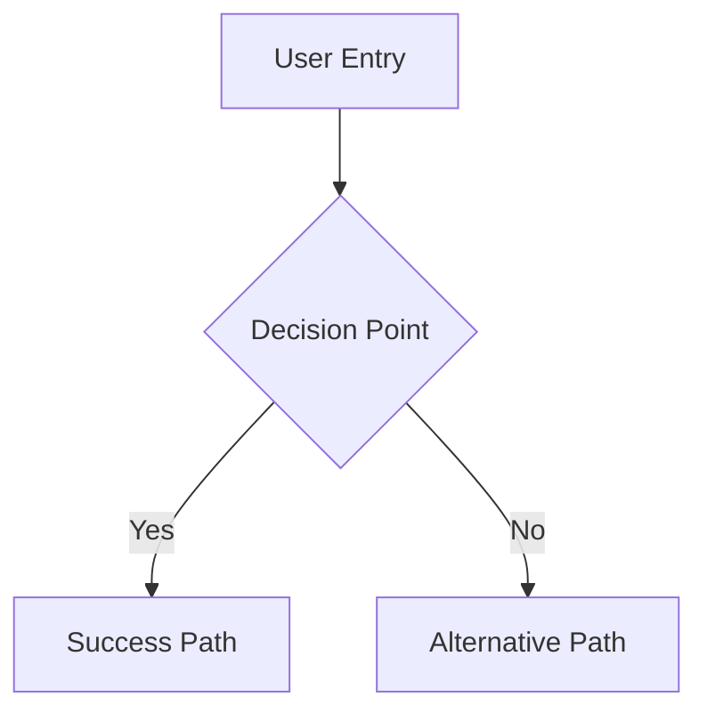
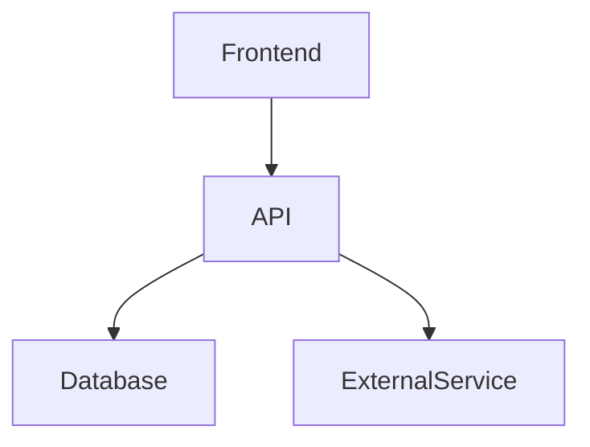

# Create PLANNING PRP

## Idea: $ARGUMENTS

Transform a rough idea into a comprehensive PRD (Product Requirements Document) with rich visual documentation, backed by parallel research for maximum depth and speed.

---

## Pre-Flight: SeedFW Setup

1. **Tech Stack Awareness** — Read `TECH_STACK.md` from the project root. Confirm with the user: "Is this tech stack correct for this feature?" (Confirm / Modify / Add). Document changes in the PRD.
2. **Documentation Fetching** — Prefer Context7 (`resolve-library-id` then `get-library-docs`); fall back to official docs. Show sources and get approval.
3. **Architecture** — Follow Vertical Slice Architecture (`docs/VERTICAL_SLICE_ARCHITECTURE.md`): organize by feature, not by layer.
4. **Quality** — Follow `docs/GOLDEN_RULES.md`: 500 lines max per file, never edit `package.json` manually, TypeScript strict mode with no `any`.

---

## Phase 1: Parallel Research Discovery

**IMPORTANT**: Launch the following 4 research agents simultaneously using multiple Agent tool calls in a single response. Do not wait for one to complete before starting the next.

### Agent 1: Market Intelligence

```
Task: Market Research Analysis
Prompt: Research the market landscape for "$ARGUMENTS". Analyze:
- Competitor landscape and positioning
- Market size, growth trends, and opportunities
- Pricing models and revenue strategies
- Existing solutions and their limitations
- Market gaps and unmet needs
- Target audience and user segments

Research only — do not write code. Use web search extensively. Return a comprehensive market analysis with specific data points and insights.
```

### Agent 2: Technical Feasibility

```
Task: Technical Architecture Research
Prompt: Analyze technical feasibility for "$ARGUMENTS". Evaluate:
- Recommended technology stacks and frameworks (cross-check against TECH_STACK.md)
- System architecture patterns and best practices
- Integration possibilities with existing systems
- Scalability and performance considerations
- Technical challenges and solutions
- Development effort estimation

Research only — no code. Use web search for current best practices. Return technical recommendations with pros/cons analysis.
```

### Agent 3: User Experience Research

```
Task: UX Pattern Analysis
Prompt: Research user experience patterns for "$ARGUMENTS". Investigate:
- User journey mapping and flow examples
- Pain points in existing solutions
- UX best practices and design patterns
- Accessibility standards and requirements
- UI trends and usability testing insights from similar products

Research only — no design creation. Use web search for UX case studies. Return UX analysis with actionable recommendations.
```

### Agent 4: Best Practices & Compliance

```
Task: Industry Standards Research
Prompt: Research industry best practices for "$ARGUMENTS". Cover:
- Security standards and compliance requirements
- Data privacy and protection regulations
- Performance benchmarks and KPIs
- Quality assurance methodologies
- Risk management, legal, and regulatory considerations

Research only. Use web search for compliance guides. Return a comprehensive best-practices guide with specific standards.
```

---

## Phase 2: Research Synthesis

Once all agents complete, synthesize findings into:

- **Market Opportunity** — size, competitive landscape, target segments/personas, value differentiation
- **Technical Architecture Framework** — recommended stack, system design, integration strategy, scalability plan
- **User Experience Blueprint** — user journeys, key interaction patterns, accessibility requirements, design system
- **Implementation Readiness** — security/compliance checklist, risk assessment, success metrics and KPIs, quality gates

---

## Phase 3: User Validation & Requirements

Before generating the final PRD, ask the user to clarify (and confirm understanding, clarify ambiguities, set boundaries):

1. **Scope & Constraints** — timeline, budget/resource constraints, must-have vs. nice-to-have features
2. **Success Definition** — primary success metrics, adoption goals, business objectives
3. **Technical Context** — existing systems to integrate, technology preferences/restrictions, team expertise
4. **User Context** — primary personas, use-case priorities, current pain points

---

## Phase 4: PRD Generation

Using `PRPs/templates/prp_planning_base.md` as the foundation, integrate research and user input.

### Visual Documentation Plan

```yaml
diagrams_needed:
  user_flows:    [happy path journey, error scenarios, edge cases]
  architecture:  [system components, data flow, integration points]
  sequences:     [API interactions, event flows, state changes]
  data_models:   [entity relationships, schema design, state machines]
```

### User Story Development

```markdown
## Epic: [High-level feature]

### Story 1: [User need]
**As a** [user type]
**I want** [capability]
**So that** [benefit]

**Acceptance Criteria:**
- [ ] Specific behavior
- [ ] Edge case handling
- [ ] Performance requirement

**Technical Notes:** implementation approach, API implications, data requirements
```

### PRD Output Structure

```markdown
1. Executive Summary           # problem, proposed solution, success criteria, resources
2. Market Analysis             # opportunity, competitive landscape, user segments (Agent 1)
3. User Experience Design      # personas, journeys, key flows w/ diagrams, wireframes (Agent 3)
4. Technical Architecture      # system design w/ diagrams, stack, integration, scalability (Agent 2)
5. API Specifications          # endpoints with examples
6. Data Models                 # entities, schema, relationships
7. Security & Compliance       # requirements, standards, risk assessment (Agent 4)
8. Implementation Phases       # phases with dependencies (no dates), priority, MVP vs enhanced
9. Risks & Mitigations         # technical, market, and resource risks
10. Success Metrics            # KPIs, acceptance criteria, testing strategy
```

### Required Diagrams (Mermaid)

Use Mermaid for all diagrams; include legends, show error paths, and annotate complex flows.





```mermaid
gantt
    title Implementation Phases
    section Phase 1
    Research & Design: 2w
    section Phase 2
    Core Development: 2w
```

---

## Phase 5: Save & Handoff

Save the completed PRD as: `PRPs/[feature-name]/planning.md` (for spec-tracked work, save proposals under `spec/proposals/`; current truth lives in `spec/current/`).

### Quality Checklist

- [ ] All 4 research areas covered comprehensively
- [ ] User validation questions answered
- [ ] Problem clearly articulated; solution addresses it
- [ ] All user flows diagrammed (with error paths)
- [ ] Architecture visualized; APIs specified with examples
- [ ] Data models included
- [ ] Dependencies identified; implementation phases logical
- [ ] Risks identified and mitigated
- [ ] Success metrics measurable
- [ ] Ready for implementation PRP creation

### Next Steps

1. Review PRD with stakeholders.
2. Create the implementation PRP using `/create-prp` (or `/create-prp-parallel`).
3. Begin development planning.

Remember: parallel research agents create comprehensive PRDs ~4x faster than sequential research, and great PRDs prevent implementation confusion.
